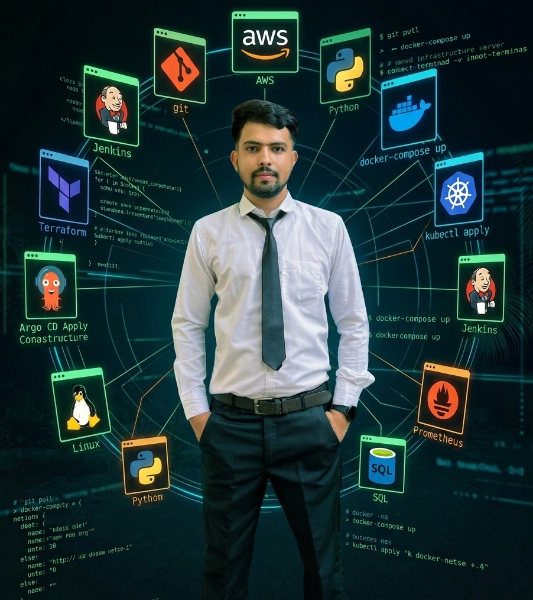

# Suman Neupane — Personal Portfolio 🚀



Welcome to the repository for my personal portfolio website, live at [sumannpn.com.np](https://sumannpn.com.np). This portfolio serves as a central hub to showcase my skills, certifications, and experimental projects in the fields of **DevOps**, **Cloud Engineering**, and **Software Engineering**.

## 🎨 Design & Architecture

The website is designed with a **DevOps/Terminal aesthetic**, utilizing modern frontend techniques to create a premium, interactive experience while remaining lightweight and fast.

**Key Features:**
- **Zero Dependencies:** Built entirely with Vanilla HTML, CSS, and JavaScript. No bulky frameworks.
- **Glassmorphism Design:** Modern UI featuring frosted glass cards with animated gradient borders and deep blurs.
- **Interactive Background:** A dynamic, canvas-based particle system that reacts to window resizing and creates a "connected infrastructure" visual.
- **Terminal Animations:** Authentic typing animations and custom cursor elements to reinforce the engineering aesthetic.
- **3D Tilt Effects:** Hardware-accelerated CSS 3D transforms (`rotateX`, `rotateY`) on project cards for an immersive hover experience.
- **Scroll Progress:** A fixed gradient scroll indicator to track reading position.

## 🛠️ Featured Projects

The portfolio highlights several of my core technical projects, including:

1. **DevOps Todo Platform:** A full-stack Flask app demonstrating Docker containerization, Docker Compose orchestration, and GitHub Actions CI/CD pipelines.
2. **Go Microservice Web App:** A containerized Go application built for high-performance and cloud-native deployments.
3. **IT Helpdesk Automator:** A collection of enterprise-grade PowerShell scripts for Windows Server system administration and IT automation.

## 💻 Run Locally

Running this project locally is extremely simple since it requires no build steps or bundlers.

1. Clone the repository:
   ```bash
   git clone https://github.com/Suman-Neupane/portfolio.git
   cd portfolio
   ```

2. Start a local HTTP server:
   ```bash
   # Using Python 3
   python3 -m http.server 8000
   ```
   *Alternatively, you can just open `index.html` directly in your browser or use an extension like VS Code Live Server.*

3. Open your browser and navigate to:
   ```
   http://localhost:8000
   ```

## 👨‍💻 About Me

I am a Computer Engineering graduate currently pursuing a Master's in Software Engineering in Germany. I am passionate about automating cloud infrastructure, building resilient CI/CD pipelines, and observing systems at scale.

**Looking for:** Werkstudent / Working Student positions in Germany (DevOps, Cloud Engineering, SRE).

## 📫 Connect With Me

- **LinkedIn:** [linkedin.com/in/suman-neupane](https://www.linkedin.com/in/suman-neupane/)
- **GitHub:** [github.com/Suman-Neupane](https://github.com/Suman-Neupane)
- **Email:** itsmesumannpn@gmail.com

---
*Built with ❤️ by Suman Neupane*
